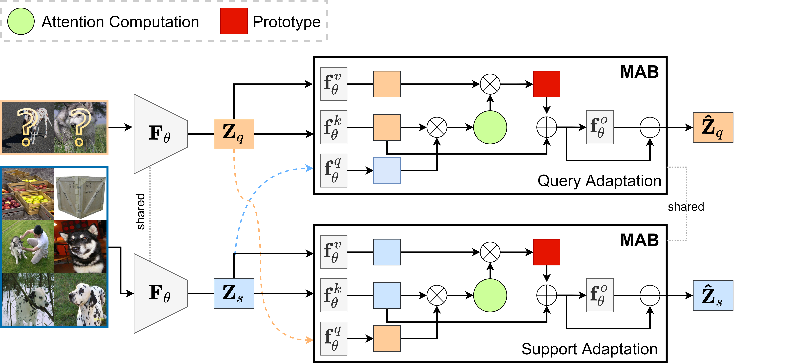

# CAD-Few-Shot-Classification
### Official Pytorch Implementation of '[CAD: Co-Adapting Discriminative Features for Improved Few-Shot Classification](https://openaccess.thecvf.com/content/CVPR2022/papers/Chikontwe_CAD_Co-Adapting_Discriminative_Features_for_Improved_Few-Shot_Classification_CVPR_2022_paper.pdf)' (CVPR 2022)


> **CAD: Co-Adapting Discriminative Features for Improved Few-Shot Classification**<br>
> Philip Chikontwe, Soopil Kim, Sang Hyun Park (DGIST)
>


> **Abstract:** *Few-shot classification is a challenging problem that aims to learn a model that can adapt to unseen classes given a few labeled samples. Recent approaches pre-train a feature extractor, and then fine-tune for episodic meta-learning. Other methods leverage spatial features to learn pixel-level correspondence while jointly training a classifier. However, results using such approaches show marginal improvements. In this paper, inspired by the transformer style self-attention mechanism, we propose a strategy to cross-attend and re-weight discriminative features for few-shot classification. Given a base representation of support and query images after global pooling, we introduce a single shared module that projects features and cross-attends in two aspects: (i) query to support, and (ii) support to query. The module computes attention scores between features to produce an attention pooled representation of features in the same class that is later added to the original representation followed by a projection head. This effectively re-weights features in both aspects (i & ii) to produce features that better facilitate improved metric-based meta-learning. Extensive experiments on public benchmarks show our approach outperforms state-of-the-art methods by 3%~5%.*


## Enviroment Requirements
* Ubuntu 20
* Python 3.7
* [CUDA 11.0](https://developer.nvidia.com/cuda-toolkit)
* [PyTorch 1.7.1](https://pytorch.org)

## Conda environmnet installation
```bash
conda env create --name cad python=3.7
conda activate cad
```
* run `pip install -r requirements.txt`

## Getting started
### Datasets
* Download datasets using scripts from [RENET-ICCV21](https://github.com/dahyun-kang/renet/tree/main/datasets)
* Place datasets in appropriate folders e.g. FewShotData.
* Change directory to `./filelists/CUB` for example.
* Check `write_filelist.py` and edit and path to the dataset.  
* run `python write_filelist.py`
* Similar steps for CIFAR-FS, tieredImageNet, and miniImageNet datasets.
* edit the path to save models in `configs.py`
 

## Train | Save Features | Test
Run
```bash ./train_cad.sh ```

Please refer to io_utils.py for additional options.

## Results
* The test results will be recorded in `./record/results.txt`

## References
Our implementation builds upon several existing publicly available code.

* [RENET-ICCV'21](https://github.com/dahyun-kang/renet/tree/main/datasets)
* [CloserLook](https://github.com/wyharveychen/CloserLookFewShot)
* [SetTransformer-ICML'19](https://github.com/juho-lee/set_transformer)

## Citation
If you find this code useful, please cite our paper.

~~~~
@InProceedings{Chikontwe_2022_CVPR,
    author    = {Chikontwe, Philip and Kim, Soopil and Park, Sang Hyun},
    title     = {CAD: Co-Adapting Discriminative Features for Improved Few-Shot Classification},
    booktitle = {Proceedings of the IEEE/CVF Conference on Computer Vision and Pattern Recognition (CVPR)},
    month     = {June},
    year      = {2022},
    pages     = {14554-14563}
}
~~~~


